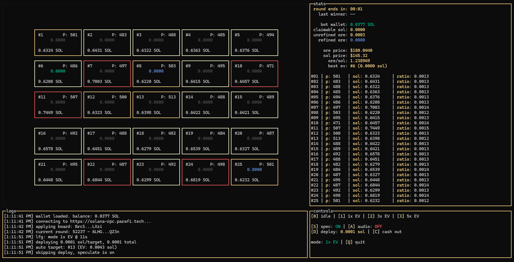

# 🌟lodestar-cli
> gm gm, lets mine & shine





**lodestar-cli** is a sophisticated, terminal-based (TUI) automation bot for the ORE v3 blockchain game on Solana. It provides a real-time dashboard of the entire game board, calculates Expected Value (EV) for all 25 squares, and automatically deploys SOL to the most profitable squares based on your chosen strategy.

---

## Features

* **Real-time TUI Dashboard:** Monitor all 25 game squares, including SOL deployed, player count, and real-time EV.
* **Advanced EV Calculation:** Continuously calculates the per-square Expected Value (EV) to identify profitable deployment opportunities.
* **Intelligent Grid Highlighting:** The game board automatically highlights squares based on two metrics:
    * **Ratio (Border):** The border of the top 5 **best** (lowest SOL/player) squares turns **yellow**. The 5 **worst** (highest) turn **red**.
    * **EV (Text):** The EV value itself is colored. The single best EV square is **green**, other positive EV squares are **blue**, and negative EV squares are **red**.
* **Automated EV-Based Deployment:** Set your strategy and let lodestar-cli execute. It automatically sends deploy transactions in the final 8 seconds of the round.
* **Multiple Automation Modes:** Choose your risk profile:
    * **`1x EV`**: Deploys to the single best positive-EV square.
    * **`3x EV`**: Deploys to the top 3 best positive-EV squares.
    * **`5x EV`**: Deploys to the top 5 best positive-EV squares.
* **Speculation Mode:** Run the bot in a "dry run" mode. It will log all actions it *would* have taken (e.g., "auto target: #12...") without actually sending any transactions or spending SOL.
* **Auto-Checkpointing:** Automatically sends checkpoint transactions between rounds to keep your miner account in sync and claim rewards.
* **Real-time Price Tracking:** Pulls live ORE/SOL/USD prices from DexScreener to ensure EV calculations are always based on the latest market data.
* **Audio Alerts:** Plays a sound for important events, like a new round winner or a large "pool delta" (a significant SOL difference between the highest and lowest squares).

---

## Prerequisites

1.  **Node.js:** You must have Node.js (v18 or newer) installed.
2.  **Solana CLI Wallet:** This tool **does not** use a private key in a `.env` file. It is designed to securely use the default `solana-cli` wallet.

---

## Installation & Running

1.  **Download the Code:**
    Download or clone this repository.
    ```sh
    git clone https://github.com/Radiants-DAO/lodestar-cli.git
    cd lodestar-cli
    ```

2.  **Install Dependencies:**
    ```sh
    npm install
    ```

3.  **Run the Application:**
    ```sh
    npm run start
    ```

---

## Configuration (Wallet Setup)

lodestar-cli requires a funded Solana CLI wallet to function. It will **not** ask for your private key.

1.  **Install Solana CLI:**
    If you don't have it, install the [Solana CLI tools](https://docs.solana.com/cli/install).

2.  **Set up Your Wallet:**
    Create a new wallet or recover an existing one.
    ```sh
    # To create a new wallet
    solana-keygen new

    # To recover an existing wallet
    solana-keygen recover
    ```

3.  **Confirm Wallet Path:**
    lodestar-cli automatically looks for your wallet at the default `solana-cli` path. Ensure your `id.json` file is in one of these locations:

    * **Linux / macOS:** `~/.config/solana/id.json`
    * **Windows:** `C:\Users\YOUR_USERNAME\.config\solana\id.json`

4.  **Fund Your Wallet:**
    Ensure the wallet at this path is funded with the SOL you wish to use for deploying and covering transaction fees.

---

## How to Use lodestar-cli

### The TUI Layout

* **Game Board (Left):** A 5x5 grid showing all 25 squares. Each square displays its ID (`#1` - `#25`), player count (`P: 10`), deployed SOL, and real-time EV.
* **Stats (Top-Right):**
    * **Countdown:** Time remaining in the current round.
    * **Last Winner:** The winning square from the previous round.
    * **Prices:** Live ORE/SOL prices and the ORE/SOL ratio.
    * **Best EV:** The single best square to deploy to right now.
* **Stats Log (Middle-Right):** A detailed list view of all 25 squares, showing their player count, SOL, and ratio, which you can scroll through.
* **Logs (Bottom-Left):** Shows all app activity: automation triggers, transaction confirmations, errors, and status updates.
* **Controls (Bottom-Right):** Shows your current settings (Mode, Speculation, etc.) and the keybinds.

### Controls (Keybinds)

Use these keys to control the bot while it's running.

* **`0`**: Set mode to **IDLE** (Stops all automation).
* **`1`**: Set mode to **1x EV** (Deploys to the single best square).
* **`2`**: Set mode to **3x EV** (Deploys to the top 3 squares).
* **`3`**: Set mode to **5x EV** (Deploys to the top 5 squares).
* **`S`**: Toggle **Speculation Mode** (Dry Run) ON / OFF.
* **`A`**: Toggle **Audio Alerts** ON / OFF.
* **`D`**: Set custom **Deploy Amount**. A prompt will appear. This is the amount of SOL deployed *per target*.
    * *Example:* If your amount is `0.001` and you are in `3x EV` mode, the bot will deploy 0.001 SOL to 3 different squares, for a total of 0.003 SOL.
* **`Q` / `Ctrl+C`**: Quit the application.

---

## 🚀 Future Development

lodestar-cli is actively being developed. Here are some of the features and improvements planned for future releases:

* **Headless / Background Mode:**
    * Implement a true headless mode (e.g., via a `--headless` flag) designed to run as a background service.
    * Integrate with process managers like **`pm2`** for stable, 24/7 operation.
    * Allow full configuration via command-line arguments (e.g., `--method 3x --amount 0.001`).

* **Swarm & Pool Logic:**
    * Explore strategies for "swarm" deployments, where multiple instances of lodestar-cli could coordinate (or deconflict) to optimize deployments across the entire board.

* **UI/UX Enhancements:**
    * Continuously refine the TUI for better data visualization and usability.

---

## ⚠️ Disclaimer

**This is an automation tool for a blockchain application. Use it entirely at your own risk.**

This software interacts with a live blockchain and spends real SOL. Bugs may exist. The game's on-chain logic may change. The developer(s) of lodestar-cli are not responsible for any financial losses incurred from using this tool.

**Never share your `id.json` file or your private key with anyone.**